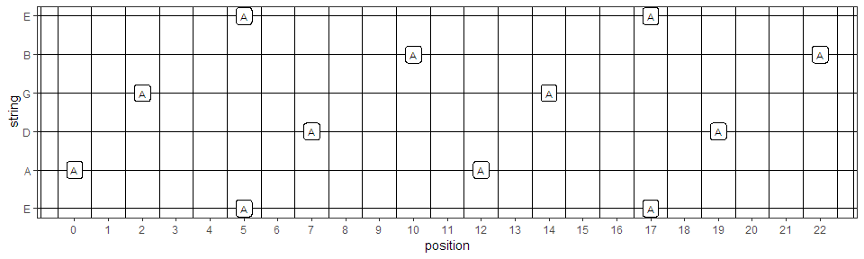
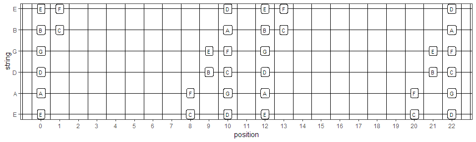
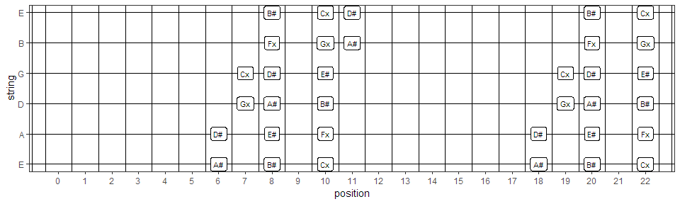
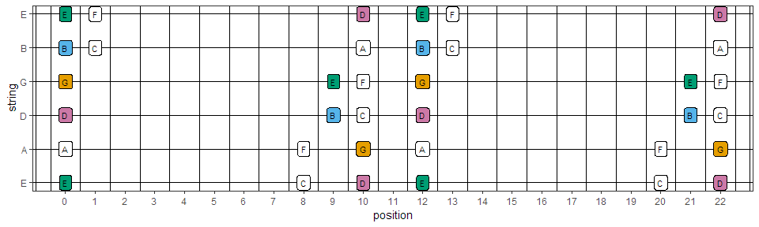
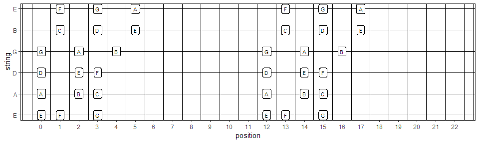
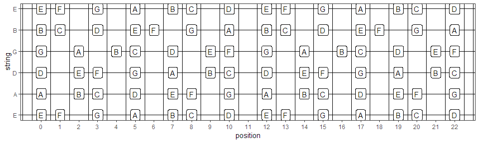
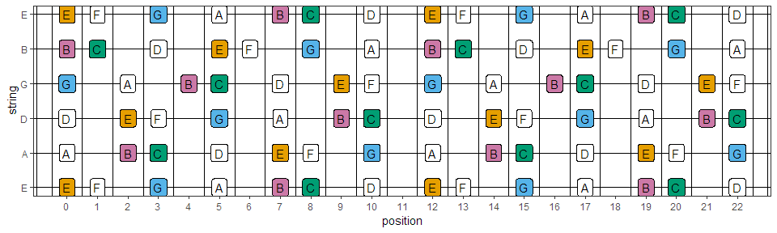

GuitarModes
================

Introduction
------------

Find the positioning of different modes on your guitar. Indicate which chords can be played in the choosen mode/tune and indicate the position of ground notes. Functions defined as R package complemented with a Shiny app for interactive usage. Available at: <https://rojorz.shinyapps.io/GuitarModes/>

Installation
------------

Using devtools the package can be installed from github:

install.packages("devtools")
library(devtools)
install\_github("RoJoRZ/GuitarModes")

Package functionality
---------------------

The package consist out of several core functions:

Done:

1.  GetNote: Get the note from a given posion (with flexible tuning)
2.  GetPosition: Get all positions of a certain note (with flexible tuning)
3.  GetMode: Get mode positions and tones (at standard tuning)
4.  CombineModes: Start with a mode in a tune and get the positions of the other modes
5.  GuitarPlot: Plot Guitar with flexible label size, number of frets, first and last fret to show

Below we give some examples of the core functions

Get a note from a given position:

``` r
GetNote(string = 1,position = 3)
```

    ##   equiv1 equiv2 equiv3
    ## 8      G     Fx    Abb

Get positions of a given note:

``` r
Apositions <- GetPosition("A")
```

    ## Warning: package 'bindrcpp' was built under R version 3.5.2

``` r
kable(Apositions)
```

|  string|  position| note |
|-------:|---------:|:-----|
|       1|         5| A    |
|       1|        17| A    |
|       2|         0| A    |
|       2|        12| A    |
|       3|         7| A    |
|       3|        19| A    |
|       4|         2| A    |
|       4|        14| A    |
|       5|        10| A    |
|       5|        22| A    |
|       6|         5| A    |
|       6|        17| A    |

Plot on a GuitarPlot

``` r
GuitarPlot(Apositions, labsize = 3)
```



Get and plot the Ionian mode in C

``` r
Ionian3 <- GetMode(tune = "C",nfrets = 22,mode = "Ionian3")
GuitarPlot(Ionian3, labsize = 3)
```



Get and plot the Ionian mode in A\#

``` r
Ionian3 <- GetMode(tune = "A#",nfrets = 22,mode = "Ionian3")
GuitarPlot(Ionian3, labsize = 3)
```



Get and plot the Ionian mode in C highlight the target notes (1,3,5) from D. Target 1 = target notes 1,3,5 and target 2 = target notes 1,3,5 and 7. Targetstart is the position of the chord in the base mode.

``` r
Ionian3 <- GetMode(tune = "C",nfrets = 22,mode = "Ionian3")
GuitarPlot(Ionian3, labsize = 3, target = 1, targetstart = 2)
```


Get and plot the Ionian mode in C highlight the target notes (1,3,5,7) from E.

``` r
Ionian3 <- GetMode(tune = "C",nfrets = 22,mode = "Ionian3")
GuitarPlot(Ionian3, labsize = 3, target = 2, targetstart = 3)
```



All the above is possible for each church mode: Ionian3, Dorian3, Phrygian3, Lydian3, MixoLydian3, Aeolian3, Locrian3. For example get and plot the Phrygian3 mode in E

``` r
Phrygian3 <- GetMode(tune = "E",nfrets = 22,mode = "Phrygian3")
GuitarPlot(Phrygian3, labsize = 3)
```



Now it is also possible to combine modes. For example get positions Ionian, Phrygian and Aeolian3 modes starting from C Ionian:

``` r
Combine <- CombineModes(tune = "C",basemode = "Ionian3", modes = c("Phrygian3", "Aeolian3"))
GuitarPlot(Combine)
```



Again but now highlighting the target notes from the C7 chord:

``` r
Combine <- CombineModes(tune = "C",basemode = "Ionian3", modes = c("Phrygian3", "Aeolian3"))
GuitarPlot(Combine, target = 2, targetstart = 1)
```



Or completely flexible generate any chord or setting in the plot

``` r
Ecord <- data.frame(string = c(1,2,3,4,5,6), 
                    position = c(0,2,2,1,0,0), 
                    note = c("E", "B", "E", "G#/Ab","B", "E"))
GuitarPlot(Ecord, nfrets = 4, labsize = 4)
```


