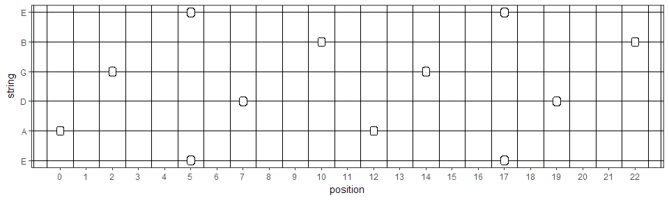
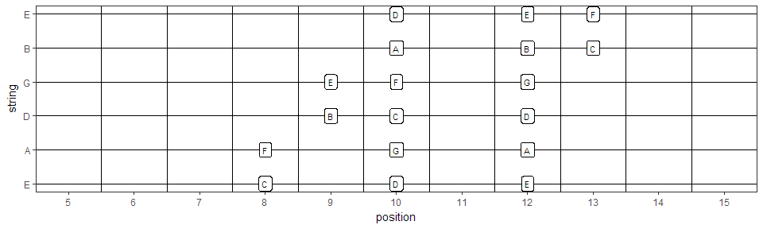
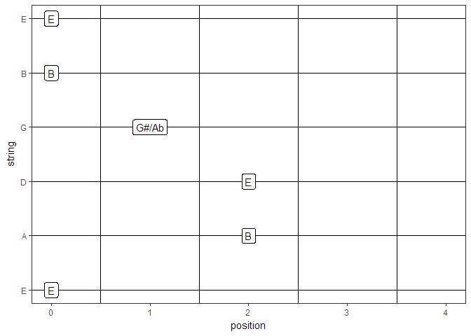

GuitarModes
================

Package functionality
---------------------

Find the positioning of different modes and ground tones on your guitar

Get a note from a given position:

``` r
GetNote(string = 1,position = 3)
```

    ## [1] "G"

Get positions of a given note:

``` r
Apositions <- GetPosition("A")
kable(Apositions)
```

|  string|  position| note |
|-------:|---------:|:-----|
|       6|         5| A    |
|       5|        10| A    |
|       6|        17| A    |
|       5|        22| A    |
|       2|         0| A    |
|       4|         2| A    |
|       1|         5| A    |
|       3|         7| A    |
|       2|        12| A    |
|       4|        14| A    |
|       1|        17| A    |
|       3|        19| A    |

Plot on a GuitarPlot

``` r
GuitarPlot(Apositions, labsize = 0)
```



Get and plot the Ionian mode in C

``` r
Ionian <- GetMode("C", "Ionian3")
GuitarPlot(Ionian, labsize = 3, firstfret = 5, lastfret = 15)
```



Or completely flexible generate any chord or setting in the plot

``` r
Ecord <- data.frame(string = c(1,2,3,4,5,6), 
                    position = c(0,2,2,1,0,0), 
                    note = c("E", "B", "E", "G#/Ab","B", "E"))
GuitarPlot(Ecord, nfrets = 4, labsize = 4)
```


